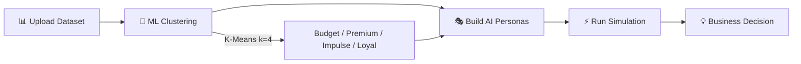

<div align="center">


# 🔮 RESONANCE
### *The Digital Crystal Ball for Business Decisions*

**Simulate thousands of AI-powered customer "Digital Twins" before making a single real-world change.**

[](https://nodejs.org)
[](https://python.org)
[](https://scikit-learn.org)
[](https://ai.google.dev)
[](LICENSE)
[](.)

---

> *"We don't just tell you that sales will drop — we show you **which customers will leave**, **why they're unhappy**, and **what specific price brings them back** — all by simulating thousands of AI Digital Twins in seconds."*

</div>

---

## 📖 Table of Contents

- [What is RESONANCE?](#-what-is-resonance)
- [The Problem We Solve](#-the-problem-we-solve)
- [Live Demo: The Kentucky Shoes Scenario](#-live-demo-the-kentucky-shoes-scenario)
- [How It Works](#-how-it-works)
- [ML + GenAI Architecture](#-ml--genai-architecture)
- [Tech Stack](#-tech-stack)
- [Project Structure](#-project-structure)
- [Getting Started](#-getting-started)
- [ML Model Details](#-ml-model-details)
- [API Reference](#-api-reference)
- [Hackathon Notes](#-hackathon-notes)

---

## 🔮 What is RESONANCE?

RESONANCE is a **Living Behavioral Sandbox** — a full-stack AI platform that lets business owners simulate real customer decision-making *before* making any real-world changes.

Instead of risking revenue on untested strategies, you:

1. **Clone** your customer base into AI-powered "Digital Twins"
2. **Configure** a What-If scenario (e.g., remove discounts, raise prices, enter a new market)
3. **Watch** AI agents roleplay as your customers, sharing their internal thoughts
4. **Decide** with confidence — zero real-world risk taken

```
  Your Data  →  ML Clustering  →  AI Personas  →  Simulation  →  Business Insight
    📊              🧠               🎭               ⚡               💡
```

---

## 🚨 The Problem We Solve

Every business owner faces the same terrifying question:

> *"If I change my pricing / stop promotions / enter a new market... what will actually happen?"*

| The Old Way 😰 | The RESONANCE Way ✅ |
|---|---|
| Test in real life, lose revenue if it fails | Simulate it — zero real cost |
| Wait weeks for data to analyze | Get results in **seconds** |
| Run expensive A/B tests | Unlimited What-If scenarios, free |
| Trust gut feeling | Ground decisions in data-driven agent behavior |
| Hire consultants for market research | AI-powered insights for any business owner |

---

## 🎯 Live Demo: The Kentucky Shoes Scenario

**Question:** *"If I stop giving discounts on Shoes in Kentucky, will people still buy them?"*

RESONANCE spins up AI agents for each customer segment and simulates their reactions:

```
🎭 Budget Hunter Agent (Kentucky, Male, 55):
   "I usually buy these every month, but without the promo code, 
    it's not worth my Venmo balance. I found a similar pair $12 cheaper 
    elsewhere. Bring back even a 15% discount and I'll come back — 
    but full price? No way."

🎭 Loyal Customer Agent (Kentucky, Female, 42):
   "I've been buying from this brand for 3 years. I trust their quality.
    The price bump stings a little, but I'm not switching over it.
    I'll pay full price this time."

🎭 Premium Buyer Agent (Kentucky, Male, 48):
   "Full price is fine — I expect premium quality and I'm getting it.
    Actually, removing the discount makes it feel more exclusive."
```

**Instant Business Insight:** Remove discounts → Budget segment churns (~34% of your base), Loyal + Premium stay. A targeted discount *only for budget-sensitive customers* in Kentucky maximizes profit while retaining at-risk buyers.

---

## ⚙️ How It Works

```
┌─────────────────────────────────────────────────────────────────┐
│                         RESONANCE PIPELINE                      │
├─────────────┬───────────────┬──────────────────┬───────────────┤
│  DATA LAYER │   ML LAYER    │   AGENT LAYER    │  OUTPUT LAYER │
│             │               │                  │               │
│ shopping_   │ K-Means       │ Gemini / Grok    │ Simulation    │
│ trends.csv  │ Clustering    │ AI Agents        │ Chat Feed     │
│             │               │                  │               │
│ 3,900+      │ Logistic      │ Budget Hunter    │ Revenue       │
│ customer    │ Regression    │ Premium Buyer    │ Forecast      │
│ records     │               │ Impulse Shopper  │               │
│             │ Random Forest │ Loyal Customer   │ Churn Risk    │
│             │               │                  │ Report        │
│             │ Revenue       │ Each agent has   │               │
│             │ Forecasting   │ a unique system  │ Actionable    │
│             │               │ prompt built     │ Decisions     │
│             │               │ from ML data     │               │
└─────────────┴───────────────┴──────────────────┴───────────────┘
```

### The 4-Step Simulation



---

## 🧠 ML + GenAI Architecture

RESONANCE is built on a **two-layer intelligence system**:

### Layer 1 — Machine Learning (The Brain)

> Python trains models offline → exports weights to JSON → Node.js consumes at runtime

| Model | Purpose | Performance |
|---|---|---|
| **K-Means Clustering** (k=4) | Segment customers into 4 behavioral personas | Silhouette: 0.2339 |
| **Logistic Regression** | Purchase probability prediction | Accuracy: **98.33%**, F1: 0.98 |
| **Random Forest** | Churn risk classification | Accuracy: **78.59%**, F1: 0.77 |
| **Revenue Forecasting** | Expected value under discount scenarios | Probabilistic EV model |

**4 Behavioral Scores computed per customer:**

```python
price_sensitivity   = f(purchase_amount, discount_usage, promo_codes, shipping_type)
loyalty_score       = f(previous_purchases, subscription_status, review_rating, frequency)
impulse_score       = f(shipping_urgency, age, payment_speed, category)
quality_preference  = f(purchase_amount, premium_shipping, credit_card_usage)
```

These 4 features → standardized → K-Means nearest-centroid → persona assignment.

### Layer 2 — Generative AI (The Voice)

> ML-grounded persona data → rich system prompt → Gemini/Grok agent → human-readable simulation

Each AI agent receives:
- 📍 **Demographics** (age, location, preferred payment)
- 📈 **Behavioral profile** (avg spend, frequency, subscription status)  
- 🧠 **Psychological framing** (persona traits and decision-making patterns)
- 🎯 **Scenario context** (the What-If being tested)

**Result:** Cold data becomes human stories. Business owners read a chat feed — not a spreadsheet.

---

## 🛠 Tech Stack

<div align="center">

| Layer | Technology |
|---|---|
| **Frontend** | HTML5, CSS3, Vanilla JS |
| **Backend** | Node.js, Express.js |
| **ML Training** | Python, scikit-learn, pandas, numpy |
| **ML Runtime** | JavaScript (trained weights via JSON) |
| **GenAI** | Google Gemini API, Grok (xAI) via OpenAI SDK |
| **Database** | Supabase (PostgreSQL) |
| **Data** | CSV parsing via csv-parse |

</div>

---

## 📁 Project Structure

```
resonance/
│
├── 📓 ml_model_development.ipynb   # Full ML research notebook
├── 🐍 train_models.py              # Train & export scikit-learn models
│
├── src/
│   └── ml/
│       ├── predictiveModels.js     # Production ML (JS port of Python models)
│       ├── personaClusterer.js     # K-Means persona assignment
│       └── trained_model_weights.json  # Exported model weights
│
├── public/
│   └── index.html                  # Web UI / simulation dashboard
│
├── server.js                       # Express API server
├── shopping_trends.csv             # Dataset (3,900+ customer records)
├── package.json
└── README.md
```

---

## 🚀 Getting Started

### Prerequisites

- Node.js 18+
- Python 3.10+ (for retraining models only)
- Google Gemini API key / Grok API key

### 1. Clone the repository

```bash
git clone https://github.com/your-username/resonance.git
cd resonance
```

### 2. Install dependencies

```bash
npm install
```

### 3. Set up environment variables

```bash
cp .env.example .env
```

Edit `.env`:

```env
GEMINI_API_KEY=your_gemini_api_key_here
GROK_API_KEY=your_grok_api_key_here
SUPABASE_URL=your_supabase_url
SUPABASE_KEY=your_supabase_anon_key
PORT=3000
```

### 4. Run the server

```bash
npm start
# or for development:
npm run dev
```

Visit `http://localhost:3000` 🎉

---

### (Optional) Retrain ML Models

If you want to retrain the models on new data:

```bash
# Install Python dependencies
pip install pandas numpy matplotlib seaborn scikit-learn jupyter

# Train and export weights
python train_models.py

# Or explore interactively
jupyter notebook ml_model_development.ipynb
```

This regenerates `trained_model_weights.json` with updated centroids and coefficients.

---

## 📊 ML Model Details

### Customer Segmentation — 4 Personas

| Persona | Count | Avg Spend | Key Trait |
|---|---|---|---|
| 💰 **Budget Hunter** | 1,049 | ~$35 | Price-sensitive, promo-driven |
| 👑 **Premium Buyer** | 1,029 | ~$85 | Quality-first, brand-conscious |
| ⚡ **Impulse Shopper** | 788 | ~$55 | Spontaneous, trend-driven |
| 💎 **Loyal Customer** | 1,034 | ~$65 | Repeat buyer, subscription holder |

### Model Weights (Logistic Regression)

The most influential features for purchase prediction:

```
price_sensitivity     →  +5.31  (strongest positive signal)
purchase_amount       →  +4.05
loyalty_score         →  +2.54
age                   →  +0.78
quality_preference    →  -1.96  (premium buyers need different messaging)
```

### Churn Risk Factors (Random Forest)

```
review_rating         →  46.1%  importance  ← most critical
loyalty_score         →  20.3%
previous_purchases    →  11.2%
purchase_amount       →   5.7%
```

---

## 🔌 API Reference

| Endpoint | Method | Description |
|---|---|---|
| `/api/ml/forecast` | `POST` | Revenue forecast under discount scenario |
| `/api/ml/elasticity` | `POST` | Price elasticity calculation |
| `/api/ml/churn` | `POST` | Churn risk prediction per persona |
| `/api/simulate` | `POST` | Run full AI agent simulation |
| `/api/personas` | `GET` | Get current persona cluster profiles |

### Example Request

```json
POST /api/simulate
{
  "scenario": "Remove shoe discounts in Kentucky",
  "parameters": {
    "category": "Shoes",
    "location": "Kentucky",
    "discount_pct": 0,
    "price_change_pct": 0
  },
  "personas": ["budget", "loyal", "premium", "impulse"]
}
```

### Example Response

```json
{
  "simulation_id": "sim_abc123",
  "revenue_impact": -18.4,
  "churn_risk": { "budget": 0.71, "loyal": 0.22, "premium": 0.09, "impulse": 0.44 },
  "agent_responses": [
    {
      "persona": "budget",
      "agent_id": "Kentucky-Male-55",
      "response": "Too expensive without the promo code..."
    }
  ],
  "recommendation": "Apply targeted 15% discount to budget segment only"
}
```

---

## 🏆 Hackathon Notes

### Why This Approach?

| Criteria | How RESONANCE Delivers |
|---|---|
| ✅ **ML Integration** | K-Means clustering + Logistic Regression + Random Forest, trained on 3,900 real records |
| ✅ **GenAI Integration** | Gemini + Grok agents with ML-grounded persona system prompts |
| ✅ **Originality** | No other tool shows you *why* customers leave — in their own words |
| ✅ **Real Data** | `shopping_trends.csv` — not toy data, not synthetic examples |
| ✅ **Production Ready** | Node.js backend, REST API, Supabase storage, deployable today |
| ✅ **Reproducibility** | Judges can re-run `ml_model_development.ipynb` and verify all results |

### Demo Flow for Judges

```
1. ml_model_development.ipynb  →  See the full ML research & training process
2. trained_model_weights.json  →  Inspect exported model parameters
3. personaClusterer.js         →  See how JS consumes Python-trained weights
4. predictiveModels.js         →  Production ML inference layer
5. Live App Demo               →  Run the Kentucky Shoes simulation live
```

---

## 🗺 Roadmap

- [x] Core simulation engine (4 persona types)
- [x] K-Means + Logistic Regression + Random Forest models
- [x] Gemini + Grok agent integration
- [x] Web UI with scenario sliders
- [ ] Custom dataset upload for business-specific training
- [ ] Real-time LLM streaming responses
- [ ] Multi-language persona support
- [ ] Industry-specific persona packs (retail, SaaS, hospitality)
- [ ] Predictive ROI calculator
- [ ] White-label enterprise offering

---

## 🤝 Contributing

Pull requests are welcome! For major changes, please open an issue first to discuss what you would like to change.

---

## 📄 License

[MIT](LICENSE) — Built with ❤️ for Hackathon 2026

---

<div align="center">

**RESONANCE** — *Fail 100 times in the simulation. Win once in the real world.*

⭐ Star this repo if you find it useful!

</div>